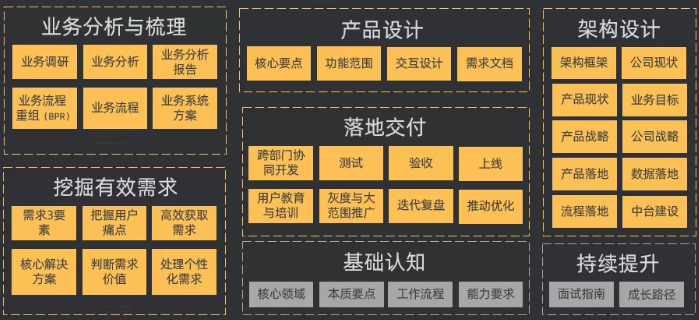

> 其实不管是B端产品还是C端产品，产品经理都需要为产品的成功负责。
> 只是产品的用户不同，侧重点也不一样。

## 前言

B端产品不同于C端产品，C端产品以用户体验为中心，而B端产品，作为产品经理，你必须知道你的产品的边界在哪，解决了什么业务问题，当然用户体验也是很重要的一环。

B端，由于每家业务都不相同，所以天然存在大量的个性化需求，因此，你去调研得到的答案可能千人千面。这里涉及到一个关键词，后面讲，叫“用户预期管理”。在讲这个之前我想把整体的内容先整理一下，以及最近一次交流（面试）的收获。

## B端的产品方法论？

做一款产品，第一要想明白用户是谁，以中台产品（kubernetes、devops）为例。

### 用户是谁？

1. 首先面对的用户是企业运维。
2. 然后是真正使用你的产品的企业内部工作人员。

### 用户需求？

1. 运维，希望通过你的产品进行减负，减少各个环境的差异，减少运维人员误操作，安全稳定，最好可以自动化运维，可以喝茶工作。
2. 开发，有的时候你很难直面开发，通常通过运维获得开发需求，这就像隔层纱，如果有幸有机会直面开发确实可以减少需求误差，开发的需求主要是针对开发测试环境的部署，以及运维知识的学习，例如k8s。

> 有了需求就直接开干吗？设计页面，写PRD，撸代码？
> **No，我觉得还差一步**

### 用户画像

直接开干就会有可能被用户带着走了，最终做出来的产品也不一定他会用，也不一定能通过一个case，打开一个行业或者方向。

建立用户画像，帮助你真正理解用户的需求。

例如运维用户画像：需要安全感，需要操作简单。开发用户画像：可以专注开发，不想去做一些不相干的。（写的比较简略，有空单独整理用户画像）

产品经理不仅要活在当下，也要放眼未来。活在当下按照需求去抄其他厂商产品就好了，但你做的产品就会有以下几个问题。

1. 功能大概率不如竞品
2. 进入市场晚，获客在竞品之后
3. 没有产品竞争优势

### 业务调研

> 以下参考了部分《人人都是产品经理》，实际上用不太全。
> 记录下来，方便在工作中review自己，部分内容也可以根据实际情况省略。

#### B端产品业务调研的目的是让我们理解业务运作的过程。

1. 了解企业业务对应的用户画像
2. 理解每个角色的核心业务工作流程
3. 明晰这些工作流程如何联合在一起，形成业务闭环。

所以，如果B端产品经理不了解业务，就很难做出正确的业务逻辑梳理。通过业务调研的方式，梳理和分析业务现状，进而更好的通过设计产品解决使用中的问题，帮助客户团队实现业务目标。

业务调研需要在有限的业务场景样本下，尽可能到业务场景中去体验，实践，统计。或者从友商产品、分享会等地方了解业务与产品的思路，**千万要避免拍脑袋、闭门造车**。

#### 系统化调研步骤：

1. 明确调研目标与调研对象
2. 输出调研计划与调研素材
3. 整理调研纪要与业务资料
   1. 组织架构，岗位职责
   2. 业务流程现状
   3. 业务表单
   4. 业务痛点
   5. 业务目标与期望
4. 输出业务现状流程与描述

#### 自上而下的流程梳理思路：（5级流程梳理）

1. 公司级-               公司商业模式、价值链
2. 公司主业务流程-       供应链顶级流程
3. 业务模块流程-         分销流程
4. 具体的业务活动流程-    销售政策流程
5. 可操作级流程-         推广管理流程

#### 整体内容

### 行业发展

尤其是中台产品，尤为需要关注行业发展，了解大家都是怎么玩的。中台产品发展到现在，底层基本都是利用开源能力进行支撑，开源的力量可以快速推进产品的发展，也形成了底层的标准化。所以在最开始我说了需要了解你产品的边界。

太多的背离底层标准化，会造成太多的不可控因素，在未来平台的升级会非常痛苦。

## 最近的一次收获

最近和未来的越级领导（VP）聊过一个话题，很有意思。

饿了么的订单在用户的一级菜单，而天猫却将订单放到我的二级中。很受启发，饿了么的用户希望通过订单去获取食物的配送进度，从而获得安全感；而天猫淘宝的用户都有了一定的预期，不会在40分钟内送到。

安全感对于一款产品来说，我觉得属于人性层面的深层需求，我还没看透人性层面的需求，还需要在积累一下。

我只看到了表象，两款产品都在对他们的用户进行预期管理。

## 用户预期管理

作为一款外卖app，饿了么的用户他希望40分钟获得他的外卖，会在40分钟内频繁的关注订单进度，放在一级菜单，更加便于用户使用。

而一款网购app，天猫淘宝他们的用户基本需要1-3天获得他们购买的东西，而网购app的核心本质是购买，两款产品都为用户预期进行管理。

VP说了一句我还记在脑子里的话“饿了么满足用户的安全感，你不饿就不太会去用它，它每天的使用是有上限的；天猫淘宝则希望用户忘记这次购买，进行再次购买”。

你的产品帮助用户解决了什么问题，从开始的时候就给予用户一定的预期，用户预期过低过高都不利于产品使用和发展。

对于人性层面的需求分析，我还需要加强呀。如果看到这了，恭喜你，看了一大篇废话，我其实是给自己一个记录的空间，如果有缘人看到了，希望能对你有帮助。
